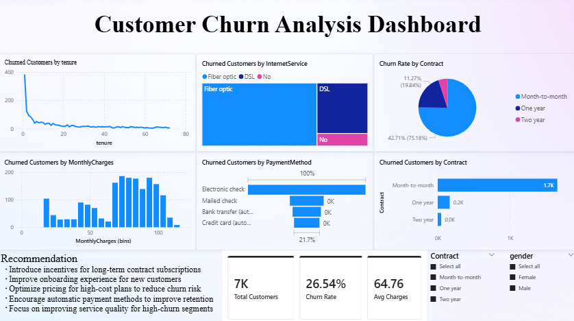

# Customer Retention & Churn Insights Dashboard

## Objective  
To analyze customer data and identify churn patterns, key retention drivers, and opportunities to improve customer retention in a subscription-based business.

## Tools Used  
- Power BI  

## Key Insights  
- Month-to-month contract customers have the highest churn rate  
- Customers with higher monthly charges are more likely to churn  
- Majority of churn occurs in the early stages of customer lifecycle  
- Customers using electronic check show higher churn compared to automatic payment methods  

## Recommendations  
- Encourage long-term contracts to improve customer retention  
- Enhance onboarding experience to reduce early-stage churn  
- Optimize pricing strategies for high-cost plans  
- Promote automatic payment methods for better retention  

## Outcome  
Developed a client-ready dashboard providing actionable insights to reduce churn and improve customer retention strategies.

## Dashboard Preview  

